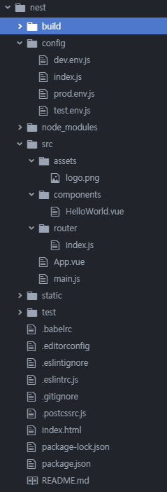

# vue 프로젝트의 구조

* **build/ : webpack** 빌드 관련 설정이 모여있는 디렉토리  
* **config/:** 프로젝트에서 사용되는 설정이 모여있는 디렉토리  
  * **dev.env.js: npm start** 시 적용되는 설정  
  * **prod.env.js: npm run build** 로 배포 버전에 적용되는 설정  
* **dist/:** 배포버전의 Vue 어플리케이션 파일들이 모여있는 디렉토리(지금 여기에는 없음)  
  **npm run build 명령어 실행시 생성됨**  
* **node_modules/: npm**으로 설치되는 서드파트 라이브러리들이 모여있는 디렉토리  
* **src/:** 실제 대부분의 코딩이 이루어지는 디렉토리  
  * **assets/:** 이미지 등 어플리케이션에서 사용되는 파일들이 모여있는 디렉토리  
  * **components/:** Vue 컴포넌트들이 모여있는 디렉토리  
  * **router/: vue-router** 설정을 하는 디렉토리  
  * **App.vue :** 가장 최상위 컴포넌트  
  * **main.js :** 가장 먼저 실행되는 javascript 파일. Vue 인스턴스를 생성하는 역할을 함  
* **index.html :** 어플리케이션의 뼈대가 되는 html 파일

